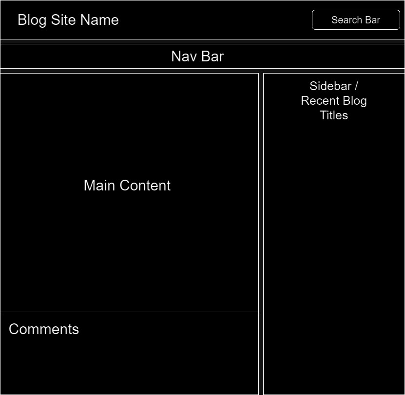
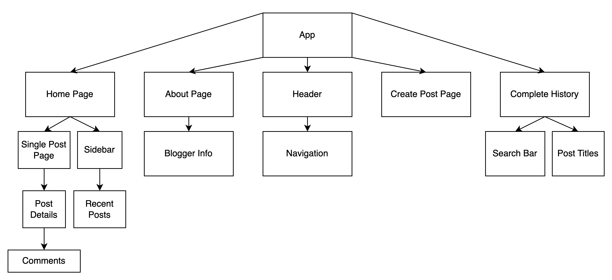
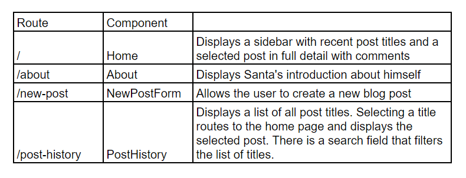
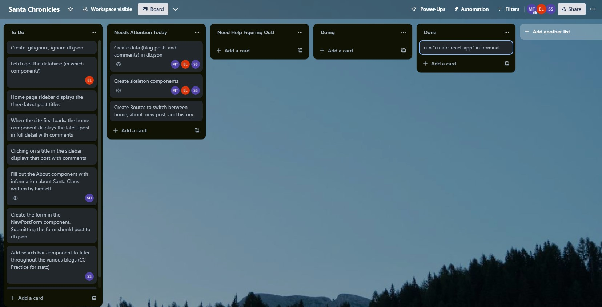

# Santa Chronicles

Santa Claus's personal blogging website

## Description about App:

This site is where Santa Claus writes his blogs and readers can find them and comment!

## User Stories (Core Deliverables):

1. On the homepage, users will be able to see a list of recent blog post titles in a sidebar. Clicking a title should display the full post.

2. User will be able to direct to a page to see Santa Claus info as a blogger, interests, and any relevant information.

3. There will be a form that Santa will use to create a new post.

## Stretch Goals

1. Have a search bar functionality to enable users to search for posts by keywords.

2. Users will be able to add comments on blog posts/view comments from others.

3. Add a favorite button.

## WireFrame

## Tree Component

## React Routes

## Database

A blog post will look like this in db.json

    {
        "id": 1,
        "date": "12-24-2023",
        "title": "Weather forceast for Christmas Eve",
        "body": "There's a blizzard in Chicago and high winds over the north east.    Otherwise clear skies. Will need to go slow in the blizzard. Ho ho ho!"
        "comments": {
            "id": 1,
            "date": 12-24-2023,
            "name": "Frosty",
            "comment": "Don't forget to bring a thermos with hot chocolate tonight!"
        }
    }

## Trello Board

